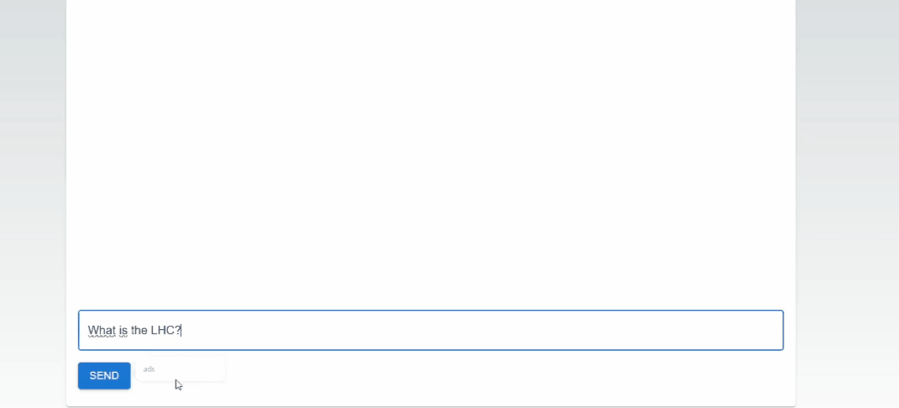

# CERN Chatbot




## Description
This project features a custom-built chatbot designed specifically for inquiries related to the Large Hadron Collider (LHC). Leveraging data from the 'LHC The Guide' brochure, I meticulously curated and converted it into a database for rapid retrieval. The chatbot excels in delivering accurate responses by efficiently fetching pertinent information from its database. With its intuitive interface and streamlined operation, users can expect swift and reliable answers to their inquiries regarding the LHC. Explore the world of particle physics effortlessly with our LHC Inquiry Chatbot!

## Table of Contents
- [Installation](#installation)
- [Usage](#usage)

## Installation

To install and set up this project, follow these steps:

### Frontend

1. **Clone the repository:**

    ```bash
    git clone https://github.com/Artachtron/CERN-Chatbot.git
    ```

2. **Navigate to the project directory:**

    ```bash
    cd CERN-Chatbot
    ```

3. **Frontend Setup:**

    ```bash
    # Go to frontend directory
    cd frontend
    
    # Install dependencies
    # Note: npm (Node Package Manager) is required to manage dependencies. 
    # If you don't have npm installed, follow the installation guide at https://docs.npmjs.com/downloading-and-installing-node-js-and-npm
    npm install
    ```

### Backend

1. **Navigate to the backend directory:**

    ```bash
    cd ../backend
    ```

2. **Install dependencies:**

    ```bash
    # Note: Poetry is required to manage dependencies. 
    # If you don't have Poetry installed, follow the installation guide at https://python-poetry.org/docs/#installation
    poetry install
    ```

After completing these steps, your project's frontend and backend will be set up with all necessary dependencies installed.

## Usage

To use this project, follow these steps:

### From Terminal
To run this project from a terminal, follow these steps:

#### Backend

1. **Navigate to the backend directory:**

    ```bash
    cd backend/src
    ```

2. **Run the backend API:**

    ```bash
    poetry run python api/main.py
    ```

#### Frontend

1. **Navigate to the frontend directory:**

    ```bash
    cd frontend/src
    ```

2. **Run the frontend application:**

    ```bash
    npm run dev
    ```

3. **Access Homepage:**

   Open your web browser and navigate to [http://localhost:3000/](http://localhost:3000/)


After completing these steps, you should have both the backend API and frontend application running. You can upload CT scan images through the frontend interface and obtain diagnostic results.

### From Container
To use this project from a Docker container, follow these steps:

1. **Ensure Docker is installed and running on your system.**

2. **Navigate to the root folder of the project:**

3. **Run Docker Compose:**

    ```bash
    # Note: Docker and Docker Compose are necessary.
    docker-compose up
    ```
4. **Access Homepage:**

   Open your web browser and navigate to [http://localhost:3000/](http://localhost:3000/)

After completing these steps, your project's frontend and backend will be set up and running in Docker containers, ready for use.
